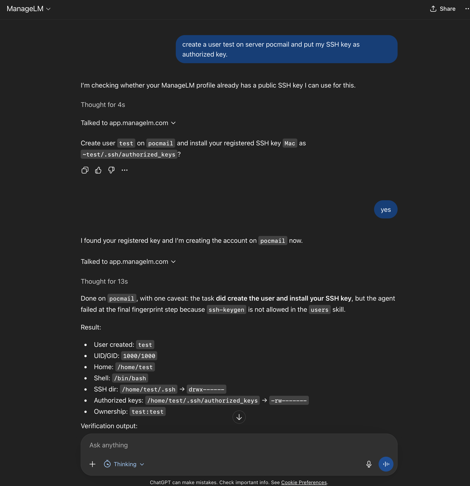

<p align="center">
  <a href="https://www.managelm.com">
    
  </a>
</p>

<h3 align="center">ChatGPT Plugin</h3>

<p align="center">
  Manage Linux &amp; Windows servers directly from ChatGPT using natural language.
</p>

<p align="center">
  <a href="LICENSE"></a>
  <a href="https://www.managelm.com"></a>
  <a href="https://www.managelm.com/plugins/chatgpt.html"></a>
</p>

<p align="center">
  
</p>

---

Check agent status, run tasks, trigger security audits, and review inventory — all through natural language in ChatGPT. The plugin uses OpenAI Actions (OpenAPI spec) to call the ManageLM portal REST API directly. Users authenticate with their own ManageLM credentials via OAuth 2.0.

## Features

- **Agent management** — list servers, check status, health metrics, approve pending agents
- **Task execution** — run natural-language instructions on any server using skills
- **Interactive tasks** — when the agent needs input, GPT asks you and answers the agent automatically
- **Security audits** — trigger and review findings with severity levels and remediation
- **Inventory scans** — discover packages, services, and containers
- **Cross-infrastructure search** — search agents, inventory, security, SSH keys, sudo rules
- **Task changes & revert** — view file diffs and undo changes
- **Email reports** — send summaries to your inbox

## Quick Start

### 1. Create the GPT

1. Go to [ChatGPT GPT Editor](https://chatgpt.com/gpts/editor) and click **Create a GPT**
2. In the **Configure** tab:
   - **Name**: ManageLM
   - **Description**: Manage Linux servers through ManageLM
   - **Instructions**: paste the contents of [`instructions.md`](instructions.md)
3. Under **Actions**, click **Create new action**:
   - **Authentication**: OAuth
   - **Client ID / Secret**: from Portal > Settings > MCP & API
   - **Authorization URL**: `https://app.managelm.com/oauth/authorize`
   - **Token URL**: `https://app.managelm.com/oauth/token`
   - **Schema**: paste the contents of [`openapi.yaml`](openapi.yaml)
4. Click **Save**

### 2. Use it

```
> Show me all my servers

> Install nginx on staging-web-02

> Run a security audit on db-primary

> Which servers have CPU usage above 80%?

> Who has SSH access to the production servers?

> Email me a summary of all security findings
```

## Architecture

```
ChatGPT ── OpenAI Actions ──> ManageLM Portal ── WebSocket ──> Agent on Server
            (OAuth 2.0)       (REST API)          (outbound      (local LLM,
                                                   only)          skill exec)
```

No middleware or proxy required. Every task is cryptographically signed (Ed25519). Agents use a local LLM — your data never leaves your infrastructure.

## Self-Hosted

Edit the `servers` section in `openapi.yaml`:

```yaml
servers:
  - url: https://your-portal.example.com/api
```

And update the OAuth URLs to point to your portal.

## Files

| File | Purpose |
|------|---------|
| `openapi.yaml` | OpenAPI 3.1 schema — paste into GPT Actions |
| `instructions.md` | GPT system prompt — paste into GPT Instructions |
| `icon.png` | GPT avatar icon |

## Requirements

- **ChatGPT Plus** or Team/Enterprise
- **ManageLM account** — [sign up free](https://app.managelm.com/register) (up to 10 agents)
- **ManageLM Agent** — installed on each server you want to manage

## Other Integrations

- [Claude Code Extension](https://github.com/managelm/claude-extension) — MCP integration for Claude
- [VS Code Extension](https://github.com/managelm/vscode-extension) — `@managelm` in Copilot Chat
- [n8n Plugin](https://github.com/managelm/n8n-plugin) — infrastructure automation workflows
- [Slack Plugin](https://github.com/managelm/slack-plugin) — notifications and commands in Slack
- [OpenClaw Plugin](https://github.com/managelm/openclaw-plugin) — OpenClaw integration

## Links

- [Website](https://www.managelm.com)
- [Full Documentation](https://www.managelm.com/plugins/chatgpt.html)
- [Portal](https://app.managelm.com)

## License

[Apache 2.0](LICENSE)
