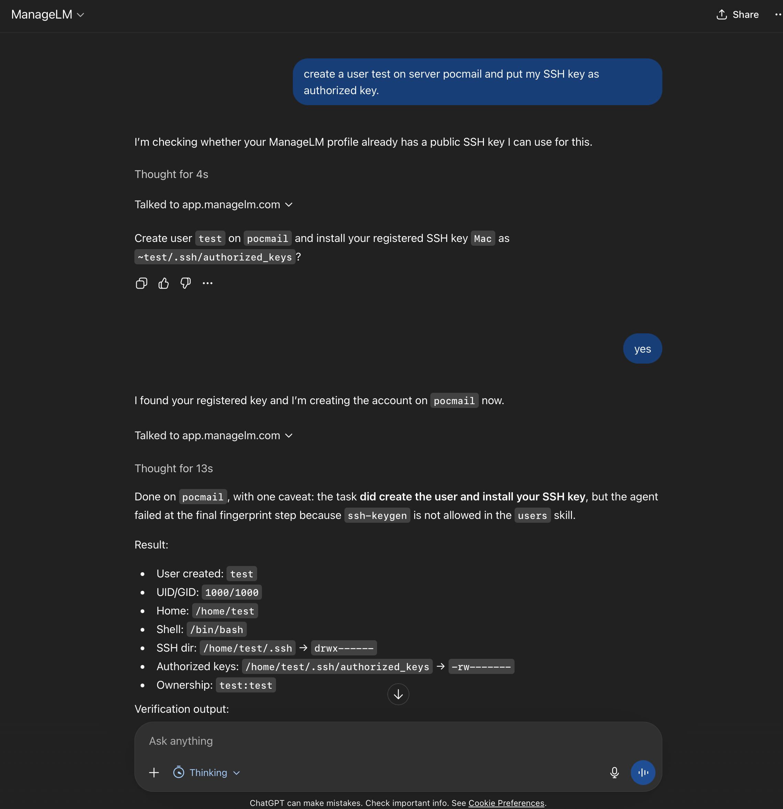

<p align="center">
  <a href="https://www.managelm.com">
    
  </a>
</p>

<h3 align="center">ChatGPT Plugin</h3>

<p align="center">
  Manage Linux &amp; Windows servers directly from ChatGPT using natural language.
</p>

<p align="center">
  <a href="LICENSE"></a>
  <a href="https://www.managelm.com"></a>
  <a href="https://www.managelm.com/plugins/chatgpt.html"></a>
</p>

<p align="center">
  
</p>

---

Check server status, run tasks and scans, search your fleet and act on cloud VMs, all through natural language in ChatGPT. The plugin uses OpenAI Actions (OpenAPI spec) to call the ManageLM portal REST API directly, with nearly all the features ManageLM gives Claude through MCP (see [Operations](#operations-30) for what stays out). Users authenticate with their own ManageLM credentials via OAuth 2.0 and act with their own permissions.

## Features

- **Task execution** — run natural-language instructions on any server using skills, or let the agent pick the skill
- **Interactive tasks** — when the agent needs input, GPT asks you and answers the agent
- **Scans** — security audits, inventory, SSH keys and sudo, certificates, user activity
- **Fleet search** — inventory, security issues, activity, SSH keys, sudo rules, certificates, monitors, backups, credentials, keystore, cloud resources
- **Hosting actions** — start, stop, reboot or snapshot a VM, with a confirmation every time
- **Task changes & revert** — view file diffs and undo changes
- **Email reports** — send summaries to your inbox

## Quick Start

### 1. Create the GPT

1. Go to [ChatGPT GPT Editor](https://chatgpt.com/gpts/editor) and click **Create a GPT**
2. In the **Configure** tab:
   - **Name**: ManageLM
   - **Description**: Manage Linux and Windows servers through ManageLM
   - **Instructions**: paste the contents of [`instructions.md`](instructions.md)
3. Under **Actions**, click **Create new action**:
   - **Authentication**: OAuth
   - **Client ID / Secret**: from Portal > Settings > MCP & API
   - **Authorization URL**: `https://app.managelm.com/oauth/authorize`
   - **Token URL**: `https://app.managelm.com/oauth/token`
   - **Token Exchange Method**: Default (POST request). The portal reads the client credentials from the request body, so "Basic authorization header" fails
   - **Schema**: paste the contents of [`openapi.yaml`](openapi.yaml)
4. Click **Save**

### 2. Use it

```
> Show me all my servers

> Install nginx on staging-web-02

> Run a security audit on db-primary

> Which servers have CPU usage above 80%?

> Who has SSH access to the production servers?

> Who logged in to db-primary yesterday?

> Which certificates expire this month?

> Email me a summary of the critical security findings
```

## Operations (30)

GPT Actions allow 30 operations, so the spec covers the ManageLM MCP tools in 30. What stays out: the skill catalog (`list_available_skills`, too large for an action response), scheduled tasks (`search_schedules`), and the sites list and the plan and usage limits that `get_account_info` returns. `get_cloud_info` is `searchCloud` plus `getConnectorActions`.

| Area | Operations |
|------|-----------|
| Servers & account | `searchAgents`, `getAgent`, `getAgentSkills`, `getAccount`, `listGroups` |
| Search | `searchInventory`, `searchSecurity`, `searchActivity`, `searchSshKeys`, `searchSudoRules`, `searchCertificates`, `searchPki`, `searchMonitors`, `searchBackups`, `searchCredentials`, `searchKeystore` |
| Hosting | `listConnectors`, `searchCloud`, `getConnectorActions`, `runConnectorAction` |
| Tasks | `submitTask`, `listTasks`, `getTask`, `answerTask`, `followUpTask`, `getTaskChanges`, `revertTask` |
| Scans | `startScan`, `getScan` (security, inventory, sshkeys, certscan, activity) |
| Utility | `sendEmail` |

ChatGPT stops waiting for an action after 45 seconds, so tasks wait 35 seconds (`wait_seconds=35`). A longer task returns its ID, and the GPT checks it with `getTask`. Tasks and scans run on one server at a time. Approving agents, users, skills, groups, API keys and webhooks are managed in the portal.

On an account set to No LLM, `submitTask`, `answerTask`, `followUpTask` and `getAgentSkills` answer 404; searches and scans still work.

If you set an **MCP / API Key IP Whitelist** (per user, in Settings > MCP & API), add OpenAI's egress IP ranges to it, or ChatGPT's calls are refused with 403.

## Architecture

```
ChatGPT ── OpenAI Actions ──> ManageLM Portal ── WebSocket ──> Agent on Server
            (OAuth 2.0)       (REST API)          (outbound      (your LLM,
                                                   only)          skill exec)
```

No middleware or proxy required. Every task is cryptographically signed (Ed25519). Each agent calls the LLM you configure for it: with a local model, your data never leaves your infrastructure.

## Self-Hosted

Edit the `servers` section in `openapi.yaml`:

```yaml
servers:
  - url: https://your-portal.example.com/api
```

And update the OAuth URLs to point to your portal.

## Files

| File | Purpose |
|------|---------|
| `openapi.yaml` | OpenAPI 3.1 schema (30 operations) — paste into GPT Actions |
| `instructions.md` | GPT system prompt — paste into GPT Instructions |
| `icon.png` | GPT avatar icon |

## Requirements

- **ChatGPT Plus** or Team/Enterprise
- **ManageLM account** — [sign up free](https://app.managelm.com/register) (up to 10 agents)
- **ManageLM Agent** — installed on each server you want to manage

## Other Integrations

- [Claude Code Extension](https://github.com/managelm/claude-extension) — MCP integration for Claude
- [VS Code Extension](https://github.com/managelm/vscode-extension) — `@managelm` in Copilot Chat
- [n8n Plugin](https://github.com/managelm/n8n-plugin) — infrastructure automation workflows
- [Slack Plugin](https://github.com/managelm/slack-plugin) — notifications and commands in Slack
- [OpenClaw Plugin](https://github.com/managelm/openclaw-plugin) — OpenClaw integration

## Links

- [Website](https://www.managelm.com)
- [Full Documentation](https://www.managelm.com/plugins/chatgpt.html)
- [Portal](https://app.managelm.com)

## License

[Apache 2.0](LICENSE)
